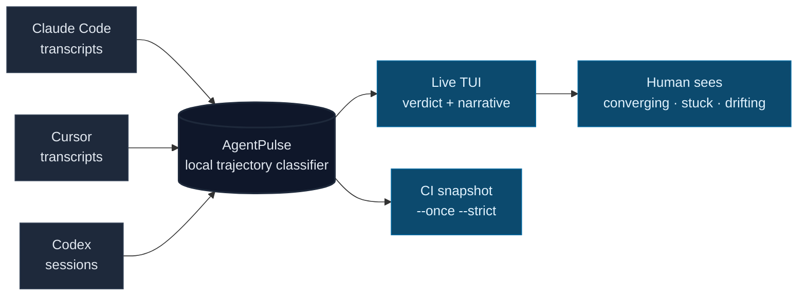

# AgentPulse

[](https://www.npmjs.com/package/@conalh/agentpulse)
[](https://github.com/Conalh/AgentPulse/actions/workflows/ci.yml)
[](LICENSE)
[](#)
[](#)
[](#)
[](#)
[](#)

**A live trajectory dashboard for AI coding agent sessions.** AgentPulse watches local Claude Code, Cursor, and Codex transcripts and classifies what each agent is doing right now: `converging`, `exploring`, `stuck`, `done`, `drifting`, or `idle`.



Drop it in a terminal next to your editor. You get an always-on read across local agent sessions without a model judge, hosted dashboard, telemetry, or outbound network calls.

Requires Node.js 22 or newer.

```sh
npx @conalh/agentpulse@latest live
```



Sample narrative on a converging session:

```
Your agent has been working on the login bug for 18 minutes. It focused
on `src/auth/`, made 3 changes to `session.ts`, and ran the tests after
each change. Tests went from failing to passing. Looks like it solved it.

Verdict: ● converging (confidence 0.85)
```

**See also:** [warden](https://github.com/Conalh/warden) for deterministic
runtime policy, [CapabilityEcho](https://github.com/Conalh/CapabilityEcho) for
PR-time capability drift, and
[agent-gov-core](https://www.npmjs.com/package/agent-gov-core) for the shared
transcript and report primitives.

## Where this fits

AgentPulse is the suite's **live-observation** layer — it watches a running session's trajectory rather than a diff or a finished transcript.

| Tool | Input | Catches / decides | Output | Use when |
|---|---|---|---|---|
| [warden](https://github.com/Conalh/warden) | policy + tool action | allow / deny / ask | verdict | you need deterministic runtime policy decisions |
| [CapabilityEcho](https://github.com/Conalh/CapabilityEcho) | PR diff | new executable capability | annotations + report | code gains network/subprocess/eval/lifecycle/workflow power |
| **AgentPulse** | live session events | trajectory state | terminal dashboard | you want live session observation |
| [agent-gov-core](https://www.npmjs.com/package/agent-gov-core) | shared schemas/parsers | common Finding/Report model | npm library | tools need shared report primitives |

## Why this exists

AI agents can run for a long time while the human is not staring at every tool call. Sometimes they converge. Sometimes they explore. Sometimes they get stuck in the same failed loop. Sometimes they touch a privileged path, pipe a network fetch straight into a shell, or write outside the repo.

AgentPulse exists to make that session state visible while the work is happening. It is deterministic local signal, not an LLM judging another LLM.

## What it shows

| Signal | What it means |
| --- | --- |
| **converging** | Focused edits plus verification, often with tests moving toward passing. |
| **exploring** | Reading and orientation, no meaningful edit trajectory yet. |
| **stuck** | Repeated edits/tests/failures, user pushback, or loop-like behavior. |
| **done** | Completion language plus idle gap. |
| **drifting** | A deterministic drift rule fired (privileged-path access, a shell-piped network fetch like `curl … \| sh`, or a write outside the repo root). See [Drift detection scope](#drift-detection-scope). |
| **idle** | Activity has gone quiet or the window had no recent movement. |

> **Drift detection scope.** <a id="drift-detection-scope"></a>The `drifting` bucket is a deterministic first-pass detector, not a comprehensive agent-safety scanner. It currently fires on exactly three rule families:
>
> - **Privileged-path access** — a tool input path, or a path-shaped token inside a shell command (quote-aware, including `bash -c "…"` payloads), touching `.ssh`, `.aws`, `.kube`, `/etc/shadow`, or `/private/var`.
> - **Shell-piped network fetch** — `curl`/`wget` piped into `sh`/`bash`/`zsh`. Detection is tokenizer-based (agent-gov-core's quote-aware `tokenizeShell`), so quoted URLs (`curl "https://…" | sh`) are caught while a `curl … | sh` quoted *inside another command's argument* (e.g. `gh release create --notes "…"`) is not a false positive.
> - **Write outside the repo root** — a `Write`/`Edit` to a path outside the session's `cwd` (or, with no repo root, outside `/tmp`, `/var`, `~`). `.`/`..` segments are resolved lexically before comparison and `~`-prefixed paths count as outside; symlink escapes are not resolved.
>
> So **`drifting` means "a known risky pattern fired" — not "this session is safe."** It does **not** yet cover `bash <(curl …)`, `curl -o … && sh …`, `bash -c "curl … | sh"` nesting, PowerShell `iwr | iex`, `python -c`/`node -e` download-and-exec, package install hooks, credential exfiltration through ordinary files, or API-driven network actions. Treat a clean run as "none of the implemented rules matched," and pair AgentPulse with the rest of the agent-gov suite for deeper gating.

## What makes it different

Several tools watch agent sessions. AgentPulse's wedge is the specific combination none of them cover:

| | Local-only | No LLM | Trajectory verdict | Per-session live dashboard | PR gate |
|---|---|---|---|---|---|
| LangSmith / Langfuse / AgentOps | ❌ cloud | ❌ LLM-judge | ❌ traces only | ⚠ | ⚠ |
| Claude Code Session Memory | ✅ | ❌ LLM | ⚠ structured | ❌ | ❌ |
| [agenttrace](https://github.com/luoyuctl/agenttrace) | ✅ | ✅ | ❌ metrics only | ⚠ TUI | ✅ |
| **AgentPulse** | ✅ | ✅ | ✅ | ✅ | ✅ |

The wedge is the combination. AgentPulse pairs naturally with agenttrace for cost/health metrics and with the rest of the agent-gov suite for PR-time gates.

## `agentpulse live` — the live dashboard

```sh
agentpulse live [options]
```

**Options:**

| Flag | Default | Effect |
| --- | --- | --- |
| `--window <duration>` | `20m` | Recap window per session (`5m`, `1h`, etc.) |
| `--refresh <duration>` | `30s` | Background refresh cadence. Watcher fires sub-second on file changes regardless. |
| `--roots <p1,p2,...>` | platform defaults | Override discovery roots (comma-separated) |
| `--stale <duration>` | `1h` | Skip sessions older than this |
| `--max-depth <N>` | unbounded | Cap discovery recursion depth below each root |
| `--exclude <d1,d2,…>` | none | Directory names to skip during discovery (e.g. `node_modules,.git`) |
| `--hide-idle` | off | Hide sessions with no activity in the window (also honored with `--once`) |
| `--max-sessions <N>` | `10` | Cap the list. With `--once` this is display-only — gating still considers every session. |
| `--show-subagents` | off | Include `agent-<hex>` SDK-spawned subagent transcripts |
| `--no-detectors` | off | Skip the drifting bucket entirely |
| `--once` | off | Headless snapshot mode. Runs once, prints, exits. |
| `--format <fmt>` | `text` | With `--once`: `text` or `json`. |
| `--strict` | off | With `--once`: exit 1 if any session is `drifting` or `stuck`. |
| `--fail-on-error` | off | With `--once --strict`: also exit 1 if a session failed to analyze (unreadable/corrupt transcript). |
| `--redact <mode>` | `none` | Redact transcript-derived paths from `--once` output: `none`, `paths`, `all`. |
| `--notify <mode>` | `none` | Local notification on transition into `drifting`/`stuck`: `none`, `bell`, `os`, `both`. |

**Keyboard:**

| Key | Action |
| --- | --- |
| ↑ ↓ / k j / w s | Move selection |
| r | Force refresh on selected session |
| a | Whitelist current session's drift findings; preview first, confirm within 3s |
| n | Name / rename the selected session alias |
| ? | Toggle help overlay |
| q / Ctrl-C | Quit |

## Agent aliases

When multiple agents work on the same project, the dashboard rows can look identical until you name them. Press `n` on a selected row, type an alias like `CC1`, `frontend`, or `backend`, and press Enter.

Aliases live in two optional JSON files:

- `<session.cwd>/.agentpulse-aliases.json` — per-project, commit if you want team-shared conventions.
- `~/.agentpulse/aliases.json` — personal default.

```json
{
  "version": 1,
  "aliases": {
    "c3d4566ef4c5": "CC1",
    "7a8b91234567": "CG1"
  }
}
```

## Exception baseline

Press `a` on a `drifting` session to preview the drift findings, then press `a` again within the confirmation window to append the selected fingerprints to `<session.cwd>/.agentpulse-exceptions.json`. AgentPulse refreshes and re-classifies the session immediately.

Commit the exception file to your repo when the behavior is intentionally approved. CI gating (`agentpulse live --once --strict` or the GitHub Action) honors the same baseline.

```json
{
  "version": 1,
  "exceptions": [
    {
      "kind": "agent_pulse.live_drift_shell_exfil",
      "fingerprint": "a1b2c3...",
      "approvedAt": "2026-05-23T22:00:00.000Z",
      "note": "approved by user via TUI"
    }
  ]
}
```

## Notifications

`--notify <mode>` fires a local notification when any session transitions into `drifting` or `stuck`.

| Mode | Effect |
| --- | --- |
| `none` | Silent |
| `bell` | Writes `\x07` to stderr |
| `os` | Native notification: `osascript` on macOS, `notify-send` on Linux, BurntToast/NotifyIcon on Windows |
| `both` | Bell + OS |

Best-effort: missing OS notification utilities are a silent no-op rather than a crash.

## CI integration

### GitHub Action

```yaml
- uses: Conalh/AgentPulse@v0.8.1
  with:
    transcript-dirs: agentpulse-transcripts
    strict: 'true'
    redact: paths
    comment-on-pr: 'true'
```

The action runs `agentpulse live --once` against the provided transcript directory, writes a markdown summary to the GitHub step summary, optionally posts a sticky PR comment, and fails the workflow when `strict: true` and any session is `drifting` or `stuck`.

By default, the gate fails closed on analysis errors (`fail-on-error: true`) and
hosted output reduces paths to basenames (`redact: paths`). Set
`fail-on-error: false` to make unreadable or corrupt transcripts advisory. Use
`redact: none` only for trusted private output, or `redact: all` when project
labels, narratives, and topic keywords may also be sensitive. Other inputs
include `max-depth` and `exclude` for bounded discovery, plus `hide-idle`,
`max-sessions`, `no-detectors`, and `show-subagents`.

> **Supply chain.** The Action builds and executes the checked-out Action source
> with `npm ci --ignore-scripts`, using the committed lockfile. Pin to a full
> commit SHA when you need AgentPulse's code and dependency graph to be
> immutable. npm remains the download source for the lockfile-pinned packages.

> **Privacy.** The step summary and PR comment contain transcript-derived
> project labels, verdicts, drift counts, narratives, and topic keywords. Paths
> are reduced to basenames by default, but labels and narrative text remain.
> Use `redact: all` when those fields may be sensitive, and never publish raw
> transcript artifacts or unreviewed JSON snapshots.

### Raw CLI

```sh
npx @conalh/agentpulse@latest live --once --strict --roots <transcript-dir>
```

Add `--format json` to pipe a structured snapshot into downstream tools.

## `agentpulse recap` — single-transcript mode

```sh
agentpulse recap --transcript-dir ~/.claude/projects/<your-project>/ --format json
```

Same pipeline, narrower input. Use `--watch` for a polling re-emit loop.

## What's intentionally not in scope

- **No LLM, anywhere.** Not for summarization, not for classification.
- **No outbound network calls.** Reads local transcript files, writes to terminal and optional local notifier.
- **No web UI / hosted dashboard.** TUI for live view, GitHub Action for PRs, JSON output for everything else.
- **No multi-session memory.** Each invocation reads the window and exits.
- **No “AI to review AI” loop.** Detectors are deterministic.

## Architecture

Deterministic pipeline. Each layer is pure where it can be; all layers share the `src/types.ts` contract.

| Layer | File | Input -> Output |
| --- | --- | --- |
| 1. Parser | `agent-gov-core/parsers/` (v1.1.0+) | Claude Code / Cursor / Codex / Antigravity JSONL -> `TranscriptEvent[]` |
| 2. Enrichment | `src/enrich.ts` | events -> keywords, cwd-relative path clusters, action classes |
| 2.5. Sequences | `src/sequences.ts` | events -> ordered-pattern signal (`tdd_loop` / `stuck_loop` / `refuse_to_verify` / `exploratory_edit`) |
| 3. Outcome | `src/trajectory.ts` | events -> verification trend, user tone, completion verbs, idle gap |
| 4. Trajectory | `src/trajectory.ts` | enrichment + outcome + sequence + exceptions -> six-bucket verdict |
| 5. Narrative | `src/narrative.ts` | verdict -> plain-English recap |

Live infrastructure on top: `src/sessions/` discovery/watcher, `src/orchestrator.ts`, `src/exceptions.ts`, `src/notifications.ts`, `src/once.ts`, and `src/tui/`.

## Design choices worth flagging

- **Local by default.** Zero network calls in any code path.
- **Deterministic.** Same transcript window in, same verdict out. No model drift, API outages, or rate limits.
- **Live observation.** AgentPulse reports the trajectory of active local
  sessions and provides a one-shot format for CI artifacts.
- **Substrate-built.** Uses
  [`agent-gov-core`](https://www.npmjs.com/package/agent-gov-core) primitives
  where the parser and report contracts overlap.
- **Tested.** 296 tests (`npm test`), including hand-rolled **property tests**
  (a seeded, replayable PRNG with 200 iterations per invariant) over the pure
  classifier layers and a **labeled golden-replay corpus** of 13 transcript
  fixtures spanning all six trajectory buckets across Claude Code, Cursor,
  Codex, and Antigravity.

## Windows terminal note

If you're running on Windows, prefer **Windows Terminal** over legacy cmd.exe. It works on cmd.exe, but Windows Terminal renders the dashboard more cleanly.

## Related public tools

| Repo | What it catches |
| --- | --- |
| [warden](https://github.com/Conalh/warden) | Deterministic allow / deny / ask policy decisions. |
| [CapabilityEcho](https://github.com/Conalh/CapabilityEcho) | Capability drift introduced by code, manifests, workflows, and Dockerfiles. |
| **AgentPulse** *(this repo)* | Live local trajectory verdicts for active agent sessions. |
| [agent-gov-core](https://www.npmjs.com/package/agent-gov-core) | Shared parsers, the canonical `Finding` schema, and `mergeFindings`. |

MIT.
